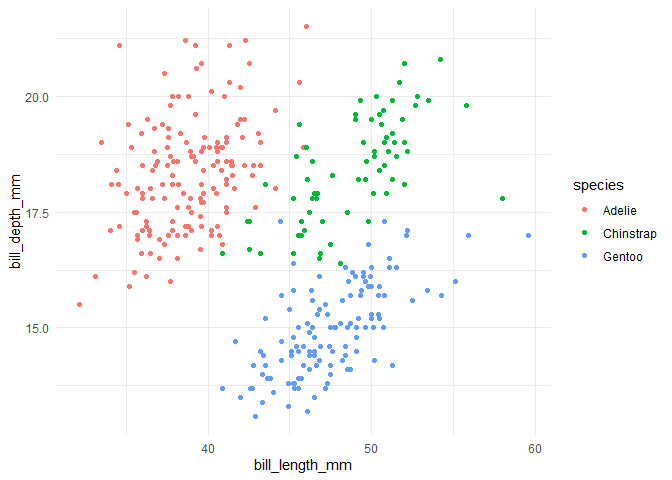
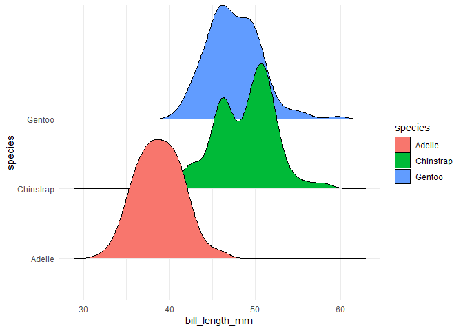
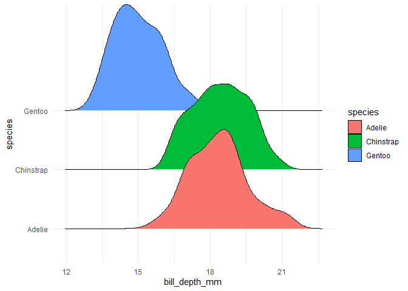
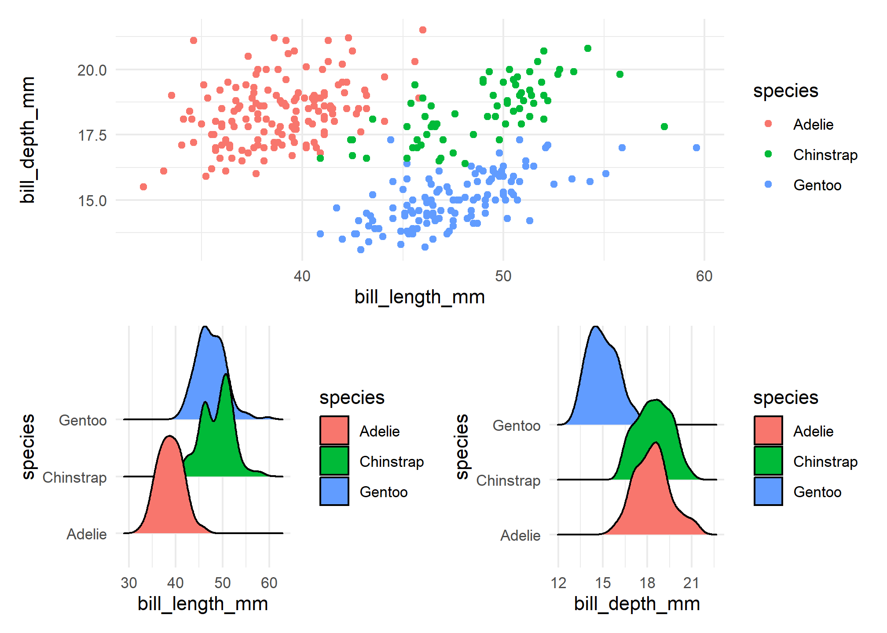

## Load data


```r
tt <- tidytuesdayR::tt_load(2020, week = 31)
```

```
## --- Compiling #TidyTuesday Information for 2020-07-28 ----
```

```
## --- There are 2 files available ---
```

```
## --- Starting Download ---
```

```
## 
## 	Downloading file 1 of 2: `penguins.csv`
## 	Downloading file 2 of 2: `penguins_raw.csv`
```

```
## --- Download complete ---
```

## Readme


```r
tt
```


## Using the clean dataset


```r
penguins <- tt$penguins
```

### Glimpse data


```r
glimpse(penguins)
```

```
## Rows: 344
## Columns: 8
## $ species           <chr> "Adelie", "Adelie", "Adelie", "Adelie", "Adelie",...
## $ island            <chr> "Torgersen", "Torgersen", "Torgersen", "Torgersen...
## $ bill_length_mm    <dbl> 39.1, 39.5, 40.3, NA, 36.7, 39.3, 38.9, 39.2, 34....
## $ bill_depth_mm     <dbl> 18.7, 17.4, 18.0, NA, 19.3, 20.6, 17.8, 19.6, 18....
## $ flipper_length_mm <dbl> 181, 186, 195, NA, 193, 190, 181, 195, 193, 190, ...
## $ body_mass_g       <dbl> 3750, 3800, 3250, NA, 3450, 3650, 3625, 4675, 347...
## $ sex               <chr> "male", "female", "female", NA, "female", "male",...
## $ year              <dbl> 2007, 2007, 2007, 2007, 2007, 2007, 2007, 2007, 2...
```

### Inspect rows with NA


```r
penguins %>% 
  filter(is.na(bill_length_mm))
```

```
## # A tibble: 2 x 8
##   species island bill_length_mm bill_depth_mm flipper_length_~ body_mass_g sex  
##   <chr>   <chr>           <dbl>         <dbl>            <dbl>       <dbl> <chr>
## 1 Adelie  Torge~             NA            NA               NA          NA <NA> 
## 2 Gentoo  Biscoe             NA            NA               NA          NA <NA> 
## # ... with 1 more variable: year <dbl>
```


## Remove rows with NA


```r
penguins <- penguins %>% 
  filter(!is.na(bill_length_mm))
```


## Data exploration

### Create scatterplott with penguin species as groups

You can clearly cluster the penguin species based on their bill_depth and bill_length.


```r
p1 <- penguins %>% 
  ggplot(aes(
    x = bill_length_mm,
    y = bill_depth_mm,
    color = species
    )) +
  geom_point()

print(p1)
```

<!-- -->

### Test ggridges


```r
p2 <- penguins %>% 
  ggplot(aes(
    x = bill_length_mm,
    y = species,
    fill = species
    )) +
  geom_density_ridges()

print(p2)
```

```
## Picking joint bandwidth of 1.08
```

<!-- -->


```r
p3 <- penguins %>% 
  ggplot(aes(
    x = bill_depth_mm,
    y = species,
    fill = species
    )) +
  geom_density_ridges()

print(p3)
```

```
## Picking joint bandwidth of 0.382
```

<!-- -->

#TODO patchwork and theme


```
## Picking joint bandwidth of 1.08
```

```
## Picking joint bandwidth of 0.382
```



