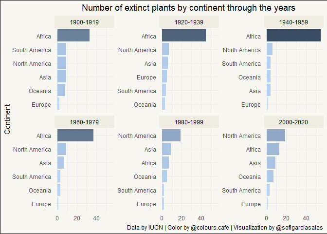

## Load data


```
## 
## 	Downloading file 1 of 3: `plants.csv`
## 	Downloading file 2 of 3: `threats.csv`
## 	Downloading file 3 of 3: `actions.csv`
```

## View data structure


```r
glimpse(plants)
```

```
## Rows: 485
## Columns: 24
## $ binomial_name     <chr> "Abutilon pitcairnense", "Acaena exigua", "Acalyp...
## $ country           <chr> "Pitcairn", "United States", "Congo", "Saint Hele...
## $ continent         <chr> "Oceania", "North America", "Africa", "Africa", "...
## $ group             <chr> "Flowering Plant", "Flowering Plant", "Flowering ...
## $ year_last_seen    <chr> "2000-2020", "1980-1999", "1940-1959", "Before 19...
## $ threat_AA         <dbl> 0, 0, 0, 1, 1, 0, 0, 0, 0, 1, 0, 0, 1, 1, 0, 0, 0...
## $ threat_BRU        <dbl> 0, 0, 0, 1, 0, 0, 0, 0, 0, 1, 1, 1, 1, 0, 1, 0, 0...
## $ threat_RCD        <dbl> 0, 0, 0, 0, 1, 1, 1, 0, 0, 1, 0, 0, 0, 1, 0, 0, 0...
## $ threat_ISGD       <dbl> 1, 1, 0, 1, 1, 0, 1, 1, 0, 0, 0, 0, 0, 0, 0, 0, 0...
## $ threat_EPM        <dbl> 0, 0, 1, 0, 0, 0, 0, 0, 0, 0, 0, 0, 0, 0, 0, 0, 0...
## $ threat_CC         <dbl> 0, 0, 0, 0, 0, 0, 0, 0, 0, 0, 0, 0, 0, 0, 0, 0, 0...
## $ threat_HID        <dbl> 0, 0, 0, 0, 0, 0, 0, 0, 0, 0, 0, 0, 0, 0, 0, 0, 0...
## $ threat_P          <dbl> 0, 0, 0, 0, 0, 0, 0, 0, 0, 0, 0, 0, 0, 0, 0, 0, 0...
## $ threat_TS         <dbl> 0, 0, 0, 0, 1, 0, 0, 0, 0, 1, 0, 0, 0, 0, 0, 0, 0...
## $ threat_NSM        <dbl> 0, 0, 0, 0, 0, 0, 0, 0, 0, 0, 0, 0, 0, 0, 0, 0, 0...
## $ threat_GE         <dbl> 1, 0, 0, 0, 0, 0, 0, 1, 0, 0, 0, 0, 0, 0, 0, 0, 0...
## $ threat_NA         <dbl> 0, 0, 0, 1, 0, 0, 0, 0, 1, 0, 0, 0, 0, 0, 0, 1, 1...
## $ action_LWP        <dbl> 1, 0, 0, 0, 0, 0, 0, 1, 0, 0, 1, 0, 0, 0, 0, 0, 0...
## $ action_SM         <dbl> 1, 0, 0, 0, 0, 1, 0, 0, 0, 0, 0, 0, 0, 0, 0, 0, 0...
## $ action_LP         <dbl> 0, 0, 0, 0, 0, 0, 0, 0, 0, 0, 0, 0, 0, 0, 0, 0, 0...
## $ action_RM         <dbl> 1, 1, 0, 0, 0, 0, 0, 1, 0, 0, 0, 0, 0, 0, 0, 0, 0...
## $ action_EA         <dbl> 0, 0, 0, 0, 0, 0, 0, 0, 0, 0, 0, 0, 0, 0, 0, 0, 0...
## $ action_NA         <dbl> 0, 0, 1, 1, 1, 0, 1, 0, 1, 1, 0, 1, 1, 1, 1, 1, 1...
## $ red_list_category <chr> "Extinct in the Wild", "Extinct", "Extinct", "Ext...
```

## Explore data
Extinct plants by continent


```r
plants %>% 
  count(continent, sort = TRUE)
```

```
## # A tibble: 6 x 2
##   continent         n
##   <chr>         <int>
## 1 Africa          217
## 2 North America    84
## 3 South America    77
## 4 Asia             57
## 5 Oceania          37
## 6 Europe           13
```

## Generate plot
Colors from @colours_cafe instagram


```r
colours_cafe <- c(
  "dark_blue" = "#384b60",
  "medium_blue" = "#5c93c4",
  "light_blue" = "#bedafa",
  "off_white" = "#f8f7f2",
  "red" = "#a83e6c")
```

### Plant extinction through the years
Used Julia Silge blog post to learn how to order plot within facets
https://juliasilge.com/blog/reorder-within/


```r
p <- plants %>% 
  filter(year_last_seen != "Before 1900") %>% 
  count(continent, year_last_seen, sort = TRUE) %>% 
  mutate(year_last_seen = as.factor(year_last_seen),
         continent = reorder_within(continent, n, year_last_seen)) %>% 
  ggplot(aes(x = n,
             y = continent,
             fill = n)) +
  geom_col(show.legend = FALSE) +
  facet_wrap(vars(year_last_seen), scales = "free_y") +
  scale_y_reordered() +
  scale_fill_gradient(
    low = colours_cafe["light_blue"], 
    high = colours_cafe["dark_blue"], 
    na.value = NA) +
  labs(
    title = "Number of extinct plants by continent through the years",
    x = NULL,
    y = "Continent",
    caption = "Data by IUCN | Color by @colours.cafe | Visualization by @sofigarciasalas"
  ) +
  theme(
    plot.title = element_text(hjust = 0.5),
    plot.background = element_rect(fill = colours_cafe["off_white"]),
    strip.background = element_rect(
      fill="#efede1", 
      colour = "#efede1"),
    strip.text = element_text(colour = "black")
  )
```
<!-- -->


---
date: '2020-08-18'

---
