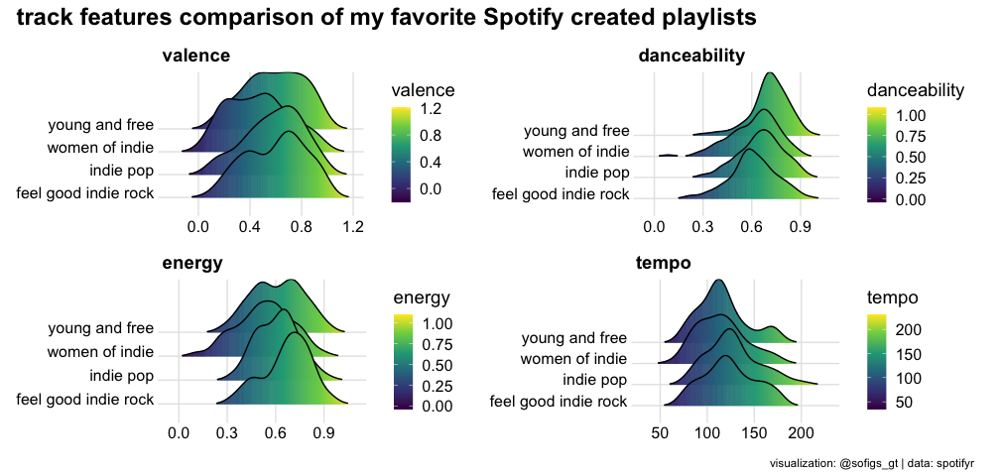

Define the playlists I want to use
#+ message=FALSE, warning=FALSE


```r
playlists <- tribble(
  ~name, ~id,
  "indie pop", "37i9dQZF1DWWEcRhUVtL8n",
  "women of indie", "37i9dQZF1DX91UQmVbQYyN",
  "young and free", "37i9dQZF1DXca8AyWK6Y7g",
  "feel good indie rock", "37i9dQZF1DX2sUQwD7tbmL"
)
```

Create a function to load the first 100 songs and their track features
(the limit is given by the Spotify API and I don't want to complicate
the code)


```r
get_playlist_track_features <- function(playlist_id, 
                                        playlist_fields = NULL, 
                                        features_fields = NULL,
                                        limit = 100, 
                                        access_token
                                        ) {
  playlist_tracks <- spotifyr::get_playlist_tracks(
    playlist_id, 
    fields = playlist_fields, 
    limit = limit,
    authorization = access_token
    )
  
  playlist_tracks %>% 
    mutate(track_features = map(
      track.id, 
      ~spotifyr::get_track_audio_features(
        .x, 
        authorization = access_token)
      )) %>% 
    unnest(track_features) %>% 
    select(all_of(c(playlist_fields, features_fields)))
    
}
```

Define the fields I want to get from get_playlist_tracks


```r
playlist_fields <- c("added_at", "track.id", "track.name", 
                  "track.popularity", "track.album.album_type")
```

Define the fields I want to get from get_track_audio_features


```r
features_fields <- c("danceability", "energy", "valence", "tempo")
```

## Load data


```r
playlist_track_features <- playlists %>% 
  mutate(
    features = map(id, ~get_playlist_track_features(
      .x,
      playlist_fields = playlist_fields,
      features_fields = features_fields,
      access_token = access_token
      ))
  ) %>% 
  unnest(features)
```

## Plot the data


```r
p1 <- ggplot(playlist_track_features,
       aes(x = valence, y = name, fill = stat(x))) +
  geom_density_ridges_gradient(scale = 3, rel_min_height = 0.01) +
  scale_fill_viridis_c(name = "valence") +
  labs(title = "valence") +
  theme_ridges() +
  theme(axis.title = element_blank())

p2 <- ggplot(playlist_track_features,
       aes(x = danceability, y = name, fill = stat(x))) +
  geom_density_ridges_gradient(scale = 3, rel_min_height = 0.01) +
  scale_fill_viridis_c(name = "danceability") +
  labs(title = "danceability") +
  theme_ridges() +
  theme(axis.title = element_blank())

p3 <- ggplot(playlist_track_features,
       aes(x = energy, y = name, fill = stat(x))) +
  geom_density_ridges_gradient(scale = 3, rel_min_height = 0.01) +
  scale_fill_viridis_c(name = "energy") +
  labs(title = "energy") +
  theme_ridges() +
  theme(axis.title = element_blank())

p4 <- ggplot(playlist_track_features,
       aes(x = tempo, y = name, fill = stat(x))) +
  geom_density_ridges_gradient(scale = 3, rel_min_height = 0.01) +
  scale_fill_viridis_c(name = "tempo") +
  labs(title = "tempo") +
  theme_ridges() +
  theme(axis.title = element_blank())
```

```
## Picking joint bandwidth of 0.0815
```

```
## Picking joint bandwidth of 0.0425
```

```
## Picking joint bandwidth of 0.0519
```

```
## Picking joint bandwidth of 8.75
```

<!-- -->


