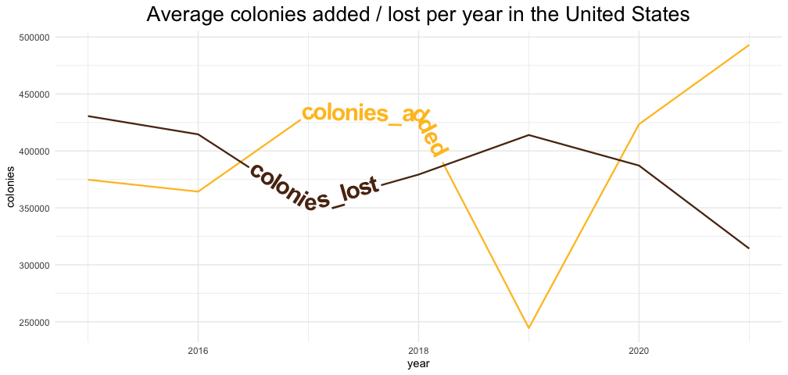

## Load data


```r
t_data <- tidytuesdayR::tt_load('2022-01-11')
```

```
## 
## 	Downloading file 1 of 2: `colony.csv`
## 	Downloading file 2 of 2: `stressor.csv`
```

```r
colony <- t_data$colony
stressor <- t_data$stressor
```

## View data structure


```r
glimpse(colony)
```

```
## Rows: 1,222
## Columns: 10
## $ year            <dbl> 2015, 2015, 2015, 2015, 2015, 2015, 2015, 2015,…
## $ months          <chr> "January-March", "January-March", "January-Marc…
## $ state           <chr> "Alabama", "Arizona", "Arkansas", "California",…
## $ colony_n        <dbl> 7000, 35000, 13000, 1440000, 3500, 3900, 305000…
## $ colony_max      <dbl> 7000, 35000, 14000, 1690000, 12500, 3900, 31500…
## $ colony_lost     <dbl> 1800, 4600, 1500, 255000, 1500, 870, 42000, 145…
## $ colony_lost_pct <dbl> 26, 13, 11, 15, 12, 22, 13, 14, 4, 4, 40, 22, 1…
## $ colony_added    <dbl> 2800, 3400, 1200, 250000, 200, 290, 54000, 4700…
## $ colony_reno     <dbl> 250, 2100, 90, 124000, 140, NA, 25000, 9500, 76…
## $ colony_reno_pct <dbl> 4, 6, 1, 7, 1, NA, 8, 9, 7, 9, 4, 1, 2, 1, NA, …
```

```r
glimpse(stressor)
```

```
## Rows: 7,332
## Columns: 5
## $ year       <dbl> 2015, 2015, 2015, 2015, 2015, 2015, 2015, 2015, 2015…
## $ months     <chr> "January-March", "January-March", "January-March", "…
## $ state      <chr> "Alabama", "Alabama", "Alabama", "Alabama", "Alabama…
## $ stressor   <chr> "Varroa mites", "Other pests/parasites", "Disesases"…
## $ stress_pct <dbl> 10.0, 5.4, NA, 2.2, 9.1, 9.4, 26.9, 20.5, 0.1, NA, 1…
```

## Explore data
colonies by year and months


```r
colony %>% 
  count(year, months)
```

```
## # A tibble: 26 × 3
##     year months               n
##    <dbl> <chr>            <int>
##  1  2015 April-June          47
##  2  2015 January-March       47
##  3  2015 July-September      47
##  4  2015 October-December    47
##  5  2016 April-June          47
##  6  2016 January-March       47
##  7  2016 July-September      47
##  8  2016 October-December    47
##  9  2017 April-June          47
## 10  2017 January-March       47
## # … with 16 more rows
```

the data is grouped by trimester


```r
stressor %>% 
  count(year, months)
```

```
## # A tibble: 26 × 3
##     year months               n
##    <dbl> <chr>            <int>
##  1  2015 April-June         282
##  2  2015 January-March      282
##  3  2015 July-September     282
##  4  2015 October-December   282
##  5  2016 April-June         282
##  6  2016 January-March      282
##  7  2016 July-September     282
##  8  2016 October-December   282
##  9  2017 April-June         282
## 10  2017 January-March      282
## # … with 16 more rows
```

```r
stressor %>% 
  count(stressor, sort = TRUE)
```

```
## # A tibble: 6 × 2
##   stressor                  n
##   <chr>                 <int>
## 1 Disesases              1222
## 2 Other                  1222
## 3 Other pests/parasites  1222
## 4 Pesticides             1222
## 5 Unknown                1222
## 6 Varroa mites           1222
```

```r
stressor %>% 
  count(state, sort = TRUE)
```

```
## # A tibble: 47 × 2
##    state           n
##    <chr>       <int>
##  1 Alabama       156
##  2 Arizona       156
##  3 Arkansas      156
##  4 California    156
##  5 Colorado      156
##  6 Connecticut   156
##  7 Florida       156
##  8 Georgia       156
##  9 Hawaii        156
## 10 Idaho         156
## # … with 37 more rows
```

There is a United States total. Only some states have individual counts
others are counted as Other States
If we add the total of the states it should equal United States total 


```r
colony %>% 
  filter(year == 2015) %>% 
  filter(state != "United States") %>% 
  count(state, wt = colony_n, sort = TRUE) 
```

```
## # A tibble: 46 × 2
##    state              n
##    <chr>          <dbl>
##  1 California   3960000
##  2 Florida       899000
##  3 North Dakota  868000
##  4 Texas         697000
##  5 South Dakota  639000
##  6 Georgia       436000
##  7 Idaho         344000
##  8 Minnesota     336000
##  9 Washington    328000
## 10 Oregon        327000
## # … with 36 more rows
```

```r
colony %>% 
  filter(year == 2015) %>% 
  filter(state != "United States") %>% 
  summarise(sum(colony_n))
```

```
## # A tibble: 1 × 1
##   `sum(colony_n)`
##             <dbl>
## 1        11681750
```

## Create plot for the United States


```r
us_colonies <- colony %>% 
  filter(state == "United States") %>% 
  group_by(year) %>% 
  summarise(
    colonies_lost = mean(colony_lost, na.rm = TRUE),
    colonies_added = mean(colony_added, na.rm = TRUE)
  ) %>% 
  pivot_longer(cols = c(
    colonies_lost, 
    colonies_added))
```
<!-- -->


